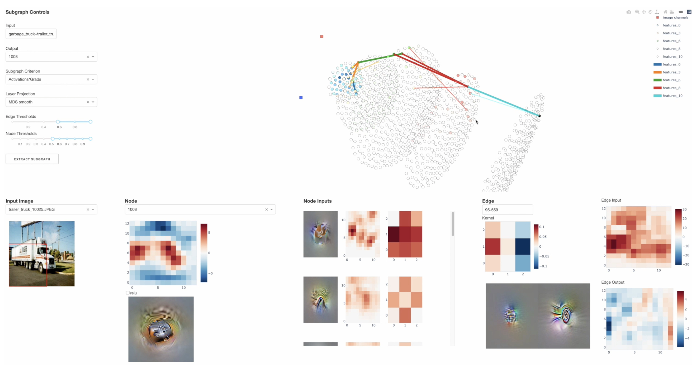

# VISCNN - Visualizing Inpterpretable Subgraphs of CNNs

<!---
https://user-images.githubusercontent.com/13317792/119274860-08d24b00-bbe0-11eb-8dad-e12c5a8f638d.mp4

-->
[[`Paper`](http://chrishamblin.xyz/writing/plai_final.pdf)] [[`Youtube Demo`](https://www.youtube.com/watch?v=_67kk1lmWXI)]

## Setup

First things first for all setup methods is to clone this repo:

`git clone https://github.com/chrishamblin7/viscnn.git`

### Conda

Enter into the downloaded git repo: `cd viscnn`
Create a new conda environment from the environment_file: `conda env create -f environment/environment.yml`
Activate the new "viscnn" environment: `conda activate viscnn`
Add the viscnn package itself to the "viscnn" environment: `pip install -e .`

### Docker
The recommended way of setting up this cnn visualizer tools environment is to use docker. If you dont have docker installed on your computer, you can [download it here](https://docs.docker.com/get-docker/)

Once you have docker install you can use docker commandline tools, and get the environment for this project by running:

`docker pull chrishamblin7/viscnn:latest`

That might take a while to download. Once its done you can launch the tool by running:

`docker run -it -v [full/path/to/cloned/repo]:/workspace -p 8050:8050 chrishamblin7/viscnn`

This command launches an interactive docker shell, with the github repo linked to the '/workspace' folder inside the container. It also links port 8050 inside the docker container to port 8050 on the root machine. You can add other forwarded ports when you launch the tool as well

## Running Visualizer

Inside your docker container, you launch the visualizer in a local web browser using

`python launch_visualizer.py`

The visualizer takes some command line arguments, to see what they are use;

`python launch_visualizer.py --help`

The only required positional argument specifies the model you would like to visualize (all possible options are shown when you run with the --help flag). So a full call to this function might look like;

`python launch_visualizer.py alexnet_sparse --cuda --device cuda:0 --port 8050`

Accessing the tool is then possible in a local web browser at the URL 'http://localhost:8050/'

## Loading Your Own Custom Models

You can load your own custom models into VISCNN, as long as they are roughly a Pytorch feed-forward CNN architecturally. Simply edit the `prep_model_parameters.py` file by following the instructions therein. Then run `python prep_model.py`. Your model will then be accessible to `python launch_visualizer.py`

